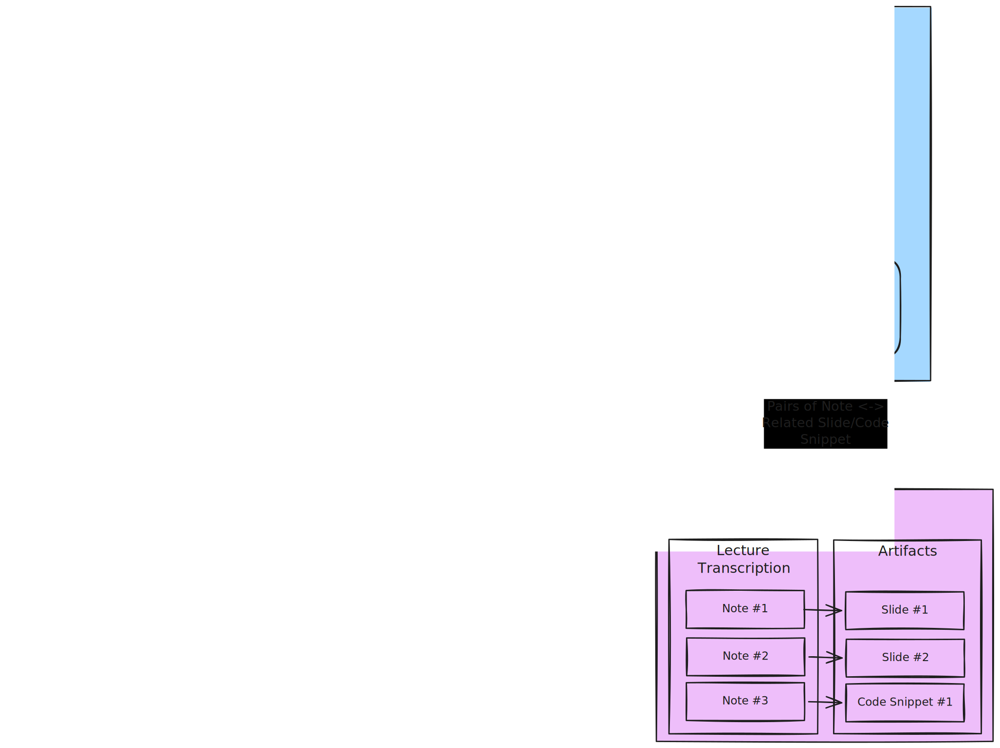
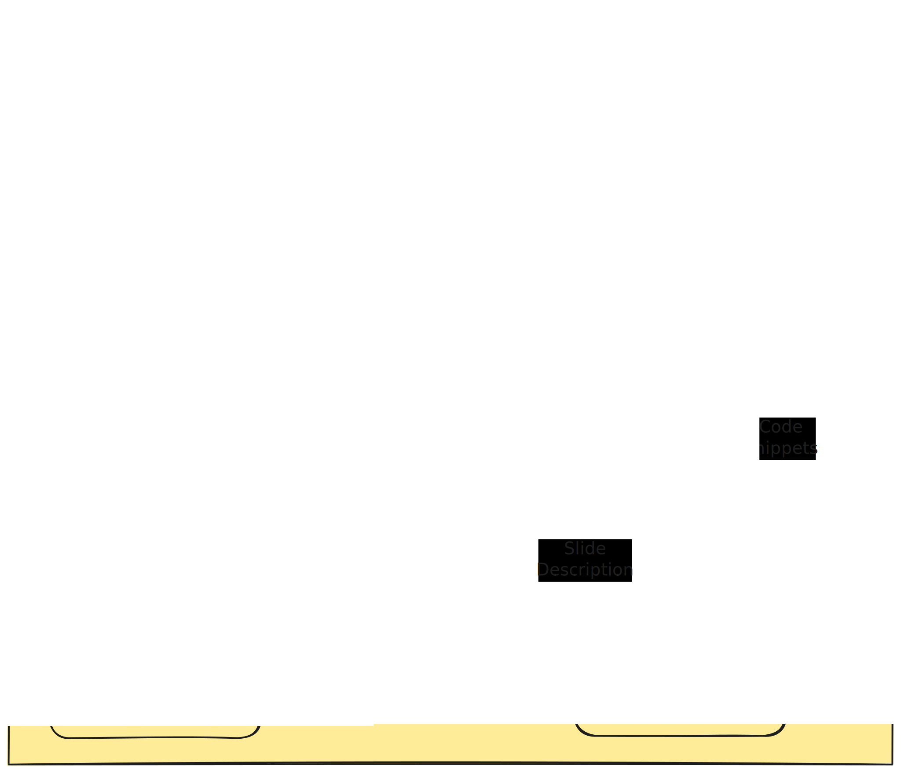
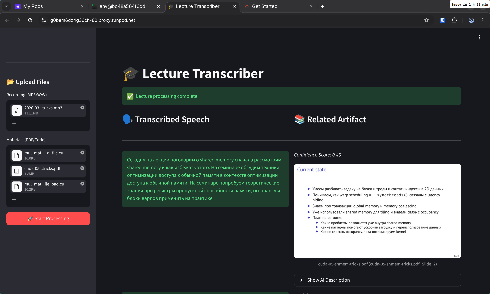

# Lecture Transcriber

Пайплайн, позволяющий преобразовать запись лекции в текст и сопоставить с материалами к ней &mdash; слайдами и фрагментами кода.

## Архитектура Приложения

Схема происходящего выглядит так:

1. Пользователь загружает запись лекции и материалы (слайды и файлы с кодом)
2. Speech-to-Text модель Whisper транскрибирует запись и выдает на выход распознанную речь. 
   
   Поскольку преподаватели на лекциях говорят в свободной форме, на самом деле половина предложений не несет смысловой нагрузки, а часть слов и междометий можно вообще выкинуть без потери смысла

3. Дообученная на транскрипциях лекций Text-to-Text модель T5 по чанкам очищает и суммаризует распознанную запись лекций.
4. В это время презентации разбиваются на слайды и отдельная модель описывает происходящее на них.
5. Код разбивается на сниппеты &mdash; функции или просто большие блоки. 
6. Предобученная модель E5 генерирует эмбеддинги для описаний слайдов, сниппетов кода и чанков суммаризированной транскрипции, которые потом сравниваются по Cosine Similarity и выбирается наиболее подходящие.

## Обучение

В основном были использованы уже предобученные модели, но некоторые модели имело смысл дообучить самостоятельно.

Пайплайн их обучения изображен на схеме ниже:

### Fine-tuning T5

Изначально эта модель была выбрана потому, что она достаточно маленькая и подходит для задачи переписывания текста с его сокращением. 

Поскольку задача ставилась на русском, я взял предобученную модель `cointegrated/rut5-base` и дообучил ее на примерах сокращения и очистки речи. 

Датасета для данной задачи на просторах интернета я не нашел, хотя казалось бы, не такая уж и специфичная задача как будто, поэтому пришлось написать отдельный ноутбук для создания датасета примеров для этой модели.

Строки датасета представляют из себя пары <чанк распознанной речи> - <сокращенный текст>, где сырая речь бралась из записей реальных лекций, а текст генерировался LLM из бесплатного API Mistral, на основе распознанной речи.

Код генерации датасета находится в [shortening_dataset.ipynb](notebooks/shortening_dataset.ipynb)

Обучение модели происходило в [shortening_train.ipynb](notebooks/shortening_train.ipynb)

### Fine-Tuning E5

Для задачи сопоставления были выбраны текстовые эмбеддинги, потому что я стремился сделать модель как можно меньше и планировал отдавать им только блоки кода и текст со слайдов презентации. 

Датасет генерировался запросами к LLM с просьбой описать слайды. 

В процессе экспериментов выяснилось, что в хороших презентациях обычно не очень много текста или кода, а в основном картинки с подписями.  
Также установилось опытным путем, что API Mistral не хватает для создания хоть сколько-нибудь приемлимого датасета, содержащего изображения, поэтому мой датасет для этой модели получился довольно посредственного качества.

Код генерации датасета находится в [semantic_search_dataset.ipynb](notebooks/semantic_search_dataset.ipynb)

Обучение модели происходило в [semantic_search_train.ipynb](notebooks/semantic_search_train.ipynb)

### Qwen2-VL

Чтобы компенсировать недостаток текста на слайдах было решено добавить мультимодальную модель, через которую можно было бы пропустить датасет и получить какое-то описание картинок и схем. В качестве такой модели была выбрана `Qwen/Qwen2-VL-7B-Instruct`, кажется +- самое маленькое из существующих решений.

### Linking

Поскольку слайды идут в последовательном порядке, а модель предсказывает чанки один за другим независимо, то я сделал обертку `SequentialLinker` над моделью, которая поддерживает текущий слайд и применяет к предсказаниям модели функцию штрафа:
довольно сильно штрафуется смена текущего файла (в реальности спикер редко переключается между презентацией и кодом), немного штрафуется переход от текущего слайда к следующему (чтобы модель не перепрыгивала на следующий слайд, если еще, возможно, читается предыдущий) и делается невозможным перескакивание назад за счет применения скользящего окна. 

### Демо

Поскольку время обработки одной лекции в районе 15 минут, то это, очевидно, невозможно захостить на HuggingFace, потому я сделал это на отдельно арендованном сервере.
Чтобы не держать сервер с GPU все время рабочим, я сделал так, чтобы один сервер без GPU, работал все время и хостил только фронтенд streamlit, а запросы посылались воркерам на серверах с видеокартами, которые всегда простаивают idle, но быстро поднимаются по запросу.

К сожалению, это все еще выходит довольно дорого, поэтому я решил что просто приложу запись демки и могу развернуть сервис, если напишете в тг [@nosorozhek239](https://t.me/nosorozhek239).

Демо (открывается по клику на изображение или по [ссылке](https://disk.yandex.com/i/Oqg_D_UR9n23Og))

### Результаты

Получилось довольно неплохо, я поздно понял, что слайды на самом деле плохо описываются только текстом на них и стоит подключить мультимодальную модель для создания лучшего описания.

Также, наверное, стоит добавить модель, которая бы описывала код и реализованный в нем алгоритм, чтобы эмбеддинги лучше справлялись с соотнесением кода и речи.

Эмбеддинги, наверное, не обязательно было дообучать, лучший результат бы дала простая предобработка кода и слайдов другими моделями.

Больше всего понравился тот момент, что можно практически без боли дообучить произвольную модель с HF, довольно легко создать датасет для своей задачи и захостить это.

В конечном итоге, это было по крайней мере прикольно, хоть и заняло какое-то конское количество времени. Немного вылез за дедлайн из-за проблемок с развертыванием, но если поставите хоть какие-то баллы, будет приятно 😇😇😇)
